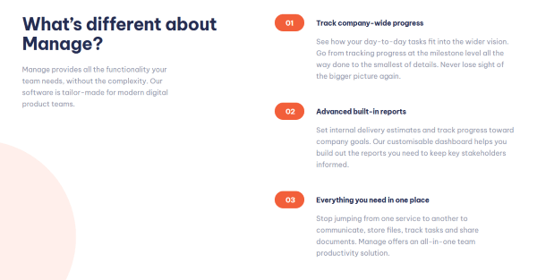
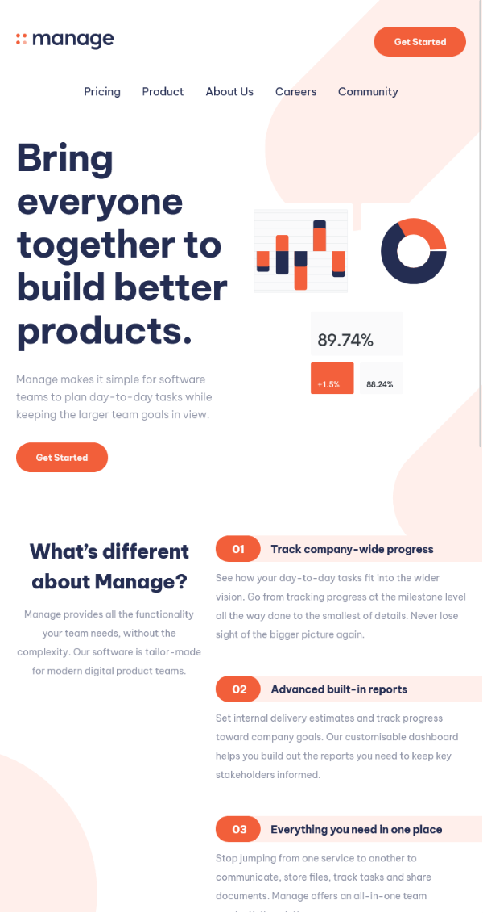
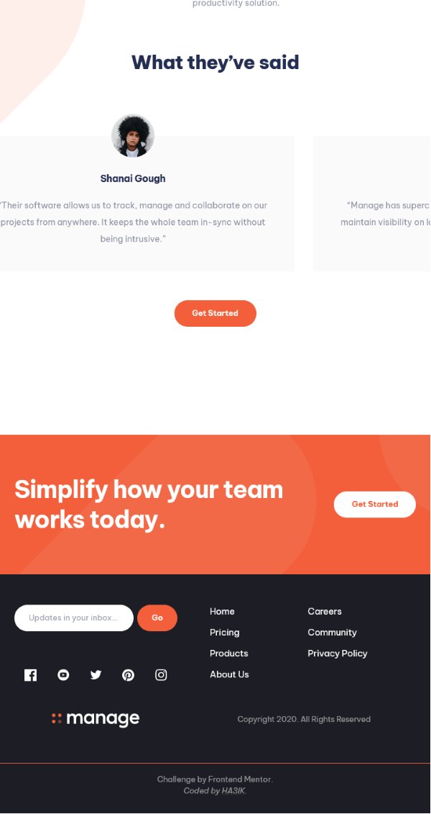

# Frontend Mentor - Manage landing page solution

This is a solution to the [Manage landing page challenge on Frontend Mentor](https://www.frontendmentor.io/challenges/manage-landing-page-SLXqC6P5).  
Frontend Mentor challenges help you improve your coding skills by building realistic projects.  
The solution *live URL*: [Manage landing page by HA3IK](https://ha3ik.github.io/fep/manage-landing-page)

## Table of contents

- [Overview](#overview)
  - [SEO](#seo)
  - [Tailwindcss](#tailwindcss)
  - [Navigation](#navigation)
  - [About section](#about-section)
  - [Testimonials](#testimonials)
  - [Footer](#footer)
  - [Decoration](#decoration)
  - [Tablet UI](#tablet-ui)
- [About](#about)
  - [Built with](#built-with)
  - [Author](#author)

## Overview

### The challenge

Users should be able to:
- [x] View the optimal layout for the site depending on their device's screen size
- [x] See hover states for all interactive elements on the page
- [x] See all testimonials in a horizontal slider
- [x] Receive an error message when the newsletter sign up `form` is submitted if:
  - [x] The `input` field is empty
  - [x] The email address is not formatted correctly

### SEO

- [x] The first word `Manage' was indicated as a term defined in the context
```html
<p><dfn>Manage</dfn> makes it simple for software teams to plan day-to-day tasks while keeping the larger team goals in view.</p>
```

### Tailwindcss

- [x] `container` is made responsive
```js
container: {
  center: true,
  screens: {
    DEFAULT: '100%',
    lg: '1158px',
  },
},
```

- [x] Fallback fonts are added to the `base` layer
```css
@layer base {
  @font-face {
    font-family: "fb-PC";
    font-stretch: normal;
    font-style: normal;
    font-weight: 300;
    src: local("VerdanaPro-Light");
    size-adjust: 100.897569%;
    ascent-override: 99.110416%;
    descent-override: 26.26426%;
    line-gap-override: 0%;
  }
  /* etc… */
}
```

### Navigation

- [x] Main `NAV`-igation also covers the logo and call-to-action buttons, because they are navigation elements as well.
```html
<nav>
  <a href="/">Logo</a>
  <ul>
    <li><a href="#pricing">Pricing</a></li>
    <!-- etc… -->
  </ul>
  <a href="#get-started">Get Started</a>
</nav>
```

- [x] Navigation is wrapped in additional `DIV`s to hide it and appear by `:target` on mobile devices as `fixed` modal and preserve scrolling of internal content (nav. list).
```html
<div>
  <!-- Fixed wrap -->
  <div class="max-md:hidden max-md:group-target/nav:nav-mob-wrap">
    <!-- Scrollable wrap -->
    <div class="max-md:group-target/nav:nav-mob-block">
      <!-- Navigation -->
    </div>
  </div>
</div>
```

- [x] Navigation close button, has two line elements that use a common reverse animation: from `rotate(0deg)` to their `rotate` degrees.
```css
.animate-btn-x {
    animation: nav-btn-close 0.5s ease-in-out reverse;
}

@keyframes nav-btn-close {
  100% {
    transform: "rotate(0deg)"
  }
}
```
```html
<a class="animate-btn-x" href="#nav-close" role="button" aria-label="Close the navigation menu">
  <div class="-rotate-45"></div>
  <div class="rotate-45"></div>
</a>
```

### About section

Has a numbered list part:



- [x] …this part was implemented via `OL` list.
```html
<ol>
  <li>
    <div class="before:content-['01']">
      <h3>Track company-wide progress</h3>
    </div>
    <p>See how your day-to-day tasks fit into the wider vision. Go from tracking progress at the milestone level all the way done to the smallest of details. Never lose sight of the bigger picture again.</p>
  </li>
  <!-- etc… -->
</ol>
```

### Testimonials

- [x] Each feedback is a `FIGURE` with a `FIGCAPTION` of the author and a `BLOCKQUOTE` of the quote.  
  The quotes themselves are without quotation marks, they are added through the `open-quote`, `close-quote` constants.
```html
<figure>
  <figcaption>Anisha Li</figcaption>
  <blockquote class="after:content-[close-quote] before:content-[open-quote]">
    Manage has supercharged our team’s workflow…
  </blockquote>
  
</figure>
```

- [x] Testimonials `sm:` (<= mobile) feed performs two unrelated but synchronized animations:
  - `feed-item` - feedback elements that change at the same rate but with different delays to create a queuing effect. `z-index` allows us to copy the quote. One element always remains `relative` to preserve the container size, the others are `absolute`.  
  `animation-duration` = `feed-item` delay * `feed-item` quantity.  
  `feed-item` change/disappear step = 100% duration / `feed-item` quantity.
  - `feed-indicator` queue position indicator. The animation logic is the same as in `feed-item`.
  [!WARNING]  
  These `feed-item` and `feed-indicator` are not related, just visually synchronized.
```css
/* Feedbacks elements */
.animate-feed:first-child {
  animation-delay: 0s;
}
.animate-feed:nth-child(2) {
  animation-delay: 10s;
}
/* etc… */
.animate-feed {
  animation: feed 40s ease-in-out forwards infinite;
}
@keyframes feed {
  0%, 24% {
    opacity: 1;
  }
  0%, 24.9999% {
    position: 'relative';
    z-index: 1;
  }
  25%, 100% {
    opacity: 0;
    position: 'absolute';
    z-index: 0;
  }
}
```

- [x] Testimonials `md:` (>= tablet) feed is `flex` and performs two main animations:
  - `feed` - `translateX`s the wrapper of all feedbacks to the left, exactly the size of one feedback (`feed-item`), to show the following feedbacks.  
  `animation-duration` = `feed-item` duration / `feed-item` quantity.
  - `feed-item` - according to the position (100% `animation-duration` / `feed-item` quantity * the `feed-item` position) changes `order:1` to move the feedback to the end of the queue.  
  At 100% `animation-duration`, all feedbacks return to their `order:0` place.
  `animation-duration` = `feed-item` duration * `feed-item` quantity.
  - The `feed-item:last-child` does not need animation.
  - So that `order:0` does not work earlier due to interpolation, we specify the most accurate values of the animation steps: `24.9999%` etc.
```css
/* Feedbacks wrapper */
.animate-feed {
  animation: feed 10s infinite linear;
}
@keyframes feed {
  100% {
    transform: translateX(-35.625rem);
  }
}

/* Feedback elements */
.animate-feed-item:first-child {
  animation: feed-item-1 40s infinite;
}
.animate-feed-item:nth-child(2) {
  animation: feed-item-2 40s infinite;
}
/* etc… */
@keyframes feed-item-1 {
  0%, 24.9999% {
    order: 0;
  }
  25%, 99.9999% {
    order: 1;
  }
  100% {
    order: 0;
  }
}
@keyframes feed-item-2 {
  0%, 49.9999% {
      order: 0;
  }
  50%, 99.9999% {
      order: 1;
  }
  100% {
      order: 0;
  }
}
/* etc… */
```

### Footer

- [x] Navigation is done via `UL > LI`, and styled via `columns: 2`.

- [x] The form error is hidden in the [aria-live=assertive] block, and tracks `:user-invalid` to appear via `peer` utility.
```html
<input class="peer/input [&:user-invalid]:form--invalid" type="email" required/>
<!-- Error messages -->
<div class="h-0 relative peer-[:user-invalid]/input:[&_>_#error-msg--invalid]:block" aria-live="assertive">
  <p id="error-msg--invalid" class="absolute hidden">Please insert a valid email</p>
</div>
```

- [x] Social network icons are external SVG "sprite".
```svg
<svg>
  <style>
    path { display: none }
    :target+path { display: inline }
  </style>
  <view id="facebook" viewBox="0 0 20 20"/>
  <path d="M18.896 0H1.104C.494 0 0 .494 ..."/>
  <view id="instagram" viewBox="0 0 21 20"/>
  <!-- etc… -->
</svg>
```

- [x] `:hover` on social network icons uses `filter: url(#filter)`, and colors them with `fecolormatrix`.
```svg
<svg height="0">
  <filter id="filter">
    <fecolormatrix values="0.95 0 0 0 0 0 0.38 0 0 0 0 0 0.24 0 0 0 0 0 1 0">
  </filter>
</svg>
```

### Decoration

- [x] Hide decorative elements outside the `BODY`: `overflow-x-hidden`.

- [x] "Try it now!" section, hides its decorative elements outside the section: `overflow-hidden`.

- [x] All decorative elements on the page are `[aria-hidden=true]`.
```html
<div class="container relative" aria-hidden="true">
  <div class="blob -right-[1.6rem] -top-[12.22rem]"></div>
  <div class="blob -right-27.5 top-[27.3125rem]"></div>
  <div class="blob -left-[30.5287rem] top-[61.5625rem]"></div>
</div>
```

### Tablet UI

- [x] Added the tablet design variant. <details>
  <summary>( Show it )</summary>
  <div style="display:flex;max-width:800px">
    
    
  </div>
</details>

## About

### Built with

- Interaction: CSS only
- Mobile-first workflow.
- [tailwindcss](https://tailwindcss.com/) - a utility-first CSS framework
- CSS: Responsive (>=240), Columns, Flexbox, Grid, animation, rendering optimization, fallback font-faces…
- HTML: Semantic and compliant with the [WHATWG "Living Standard"](https://html.spec.whatwg.org/), WAI-ARIA…
- SVG: FILTER Color Matrix, VIEW sprites…

### Author

- Frontend Mentor - [@HA3IK](https://www.frontendmentor.io/profile/ha3ik)
- Twitter - [@HA3IK](https://www.twitter.com/ha3ik)
