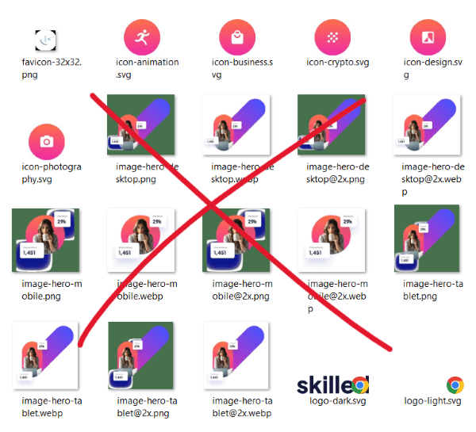
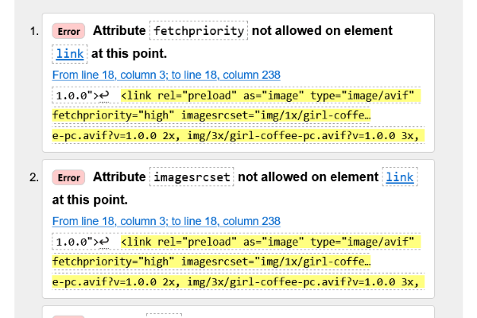
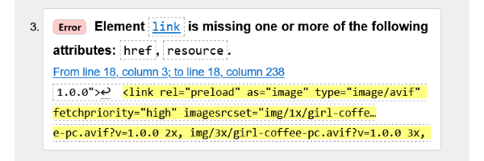
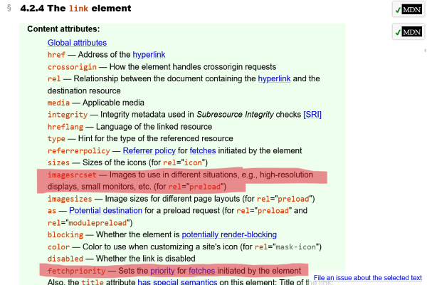
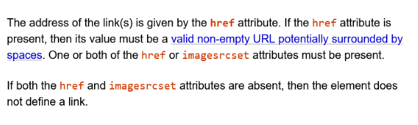
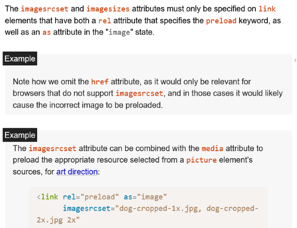
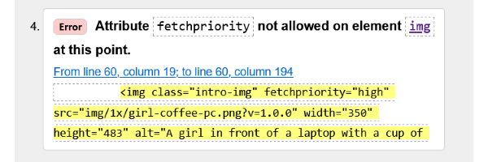
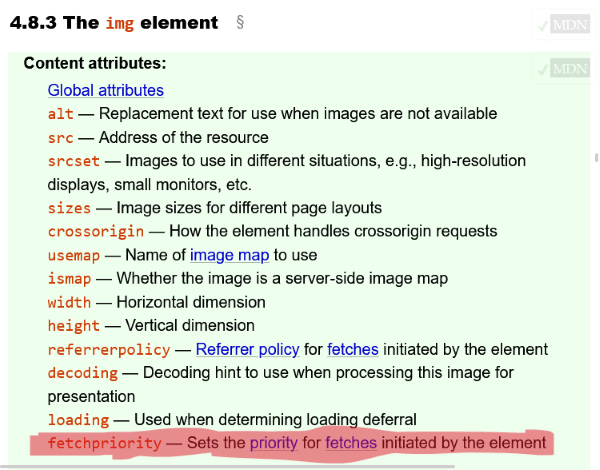

# Frontend Mentor - Skilled e-learning landing page solution

This is a solution to the [Skilled e-learning landing page challenge on Frontend Mentor](https://www.frontendmentor.io/challenges/skilled-elearning-landing-page-S1ObDrZ8q).  
Frontend Mentor challenges help you improve your coding skills by building realistic projects.  
The solution *live URL*: [Skilled e-learning landing page by HA3IK](https://ha3ik.github.io/fep/skilled-elearning-landing-page)

## Table of contents

- [Overview](#overview)
- [About](#about)
  - [Built with](#built-with)
  - [Author](#author)

## Overview

### Assets

✅ I didn't use prepared assets.
- Exported from Figma only icons and the photo of a girl with coffee and a pc.
- Everything else is implemented by HTML+CSS




### "Hero image"

✅ Implementation:

Structure:
```html
.intro-visual > .intro-img-attach + .intro-img-cover > img
```
- .intro-visual - wrapper that holds `.intro-img-attach{ position:absolute }`, but does not clip it.
- .intro-img-attach - `position:absolute` element that goes beyond the visible area at an angle of 45 degrees.
- .intro-img-cover - holds `img { position:absolute }` and clips it.
- BODY - `overflow:hidden` to clip the .intro-img-attach within the visible area.

Aligning the positions of .intro-img-attach + .intro-img-cover elements:
1. The dimensions of .intro-visual == .intro-img-cover
2. .intro-img-attach `width` == .intro-img-cover
```scss
.intro-img-attach {
  bottom: 0;
  left: 0;
  position: absolute;
  transform: rotate(45deg);
  transform: translateX(-#{ $intro-img-attach-x }); // $intro-img-cover-width / 2
  transform: translateY(-#{ $intro-img-attach-y }); // ($intro-img-cover-width / 4) sin 45deg
  transform-origin: bottom left;
  width: $intro-img-cover-width;
}
```

Statistics:   
Implemented by a Description List and valid wrapping of each group in a DIV.
```html
<dl>
  <div>
    <dt>Members</dt>
    <dd>29k</dd>
  </div>
  <div>
    <dt>Course hours</dt>
    <dd>1,451</dd>
  </div>
</dl>
```

### HTML validator error ([again](https://github.com/HA3IK/fep/blob/four-card-feature-section/README.md#semantics-of-the-complex-header))

The official W3C validator, which is also referred to by WHATWG, reports errors that are not errors according to the official WHATWG Living Standard <time datetime="2023-06-27">27 June 2023</time>.

⚠️ Don't blindly trust "The Nu Html Checker" - its database is out of date.

"Not allowed `fetchpriority` and `imagesrcset` attributes on element `link`" and omitted `href` or non-existing `resource` attributes.




But if you look at the WHATWG Living Standard in the list of Link attributes, they are there (except `resource` 😅), and `href` is optional.




\+ even WHATWG Living Standard example:



This validator is completely unaware of the existence of the `fetchpriority` attribute:




### List of courses

✅ Implemented it as the main page navigation.

```html
<nav>
  <!-- 1st element and the list title -->
  <h2>Check out our most popular courses!</h2>
  <!-- An element (course) of the list -->
  <article>
    
    <h3>Animation</h3>
    <p>Learn the latest animation techniques to create stunning motion design and captivate your audience.</p>
    <a href="#animation">Get started</a>
  </article>
  <article></article>
  <!-- etc -->
</nav>
```

### Lighthouse

✅ See the [Lighthouse report (for mobile)](https://ha3ik.github.io/fep/skilled-elearning-landing-page/_challenge/lighthouse-report-mob.html) here.

## About

### Built with

- Flex/Grid and a bit of trigonometry.
- HTML: Semantic and compliant with the WHATWG "Living Standard", WAI-ARIA…
- CSS: Responsive, rem perfect 😎👍, fallback font-faces…
- Performance: hints, minification, versioned URLs…
  …

### Author

- Frontend Mentor - [@HA3IK](https://www.frontendmentor.io/profile/ha3ik)
- Twitter - [@HA3IK](https://www.twitter.com/ha3ik)
