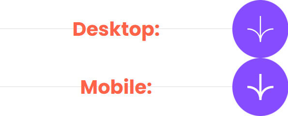

# Frontend Mentor - Age calculator app solution

This is a solution to the [Age calculator app challenge on Frontend Mentor](https://www.frontendmentor.io/challenges/age-calculator-app-dF9DFFpj-Q).  
Frontend Mentor challenges help you improve your coding skills by building realistic projects.  
The solution *live URL*: [Age calculator app by HA3IK](https://ha3ik.github.io/fep/age-calculator-app)

## Table of contents

- [Overview](#overview)
- [About](#about)
  - [Built with](#built-with)
  - [Author](#author)

## Overview

### Submit event

✅ Turned off event triggering on the button icon via CSS
```css
 button > img {
  pointer-events: none;
 }
```

✅ Preventing revalidation if input fields have not changed
```js
// IF the input data has not changed THEN return
let formData = new FormData(form).values();
formData = [...formData].join(',');
if (formDataPrev === formData) return;
// ELSE save the form data string:
formDataPrev = formData;
```

### Accessibility

✅ Reading the output content:
  - `[aria-atomic=true]` on the wrapper so that the entire response is always read: n years, n months, n days
  - `[aria-live=assertive]` on the wrapper so that the result is read immediately only if the answer is successful, and turned `off` if an error.
  - `[aria-live=off]` for the `OUTPUT` tag, which is enabled by default. Avoiding double notification.
  - The `"- -"` placeholder is labeled `[aria-label=none]`. If some number, `[aria-label]` is removed.
  - Error messages are `[role=alert]`, and `[hidden]` by default.

### Form
  - ✅ Used `INPUT[type=number]` with `[min]` and `[max]` attributes.  
  Default arrows (the spinner) are hidden via CSS:
```css
/* Webkit and Blink browsers */
input[type="number"]::-webkit-inner-spin-button,
input[type="number"]::-webkit-outer-spin-button {
  -webkit-appearance: none;
}

/* Firefox and others */
input[type="number"] {
  -moz-appearance: textfield;
}
```

### Horizontal line

✅ Added horizontal line as `background` - 1px gradient, centered, full width, no repeat.

```css
.btn-row {
  background: 50% / 100% 1px no-repeat linear-gradient(#dcdcdc, #dcdcdc);
}
```

### Assets

✅ Added svg arrow for the mobile version  
&emsp;&emsp;\- The arrows for the mobile version and for the desktop version are different.



### HTML validator error ([still there](https://github.com/HA3IK/fep/tree/skilled-elearning-landing-page#html-validator-error-again))

⚠️ "Nu Html Checker" still hasn't fix the bug to recognize the modern LINK tag structure, according to the official WHATWG Living Standard.

### Lighthouse

✅ See the [Lighthouse report (for mobile)](_challenge/lighthouse-report-mob.html) here.

## About

### Built with

- HTML: Semantic and compliant with the WHATWG "Living Standard", WAI-ARIA…
- CSS: Responsive, Flexbox, fallback font-faces…
- JS: ES6+, ValidityState API…
- [Sass](https://sass-lang.com/) - CSS preprocessor.
- [TypeScript](https://www.typescriptlang.org/) - strongly typed JS.

### Author

- Frontend Mentor - [@HA3IK](https://www.frontendmentor.io/profile/ha3ik)
- Twitter - [@HA3IK](https://www.twitter.com/ha3ik)
