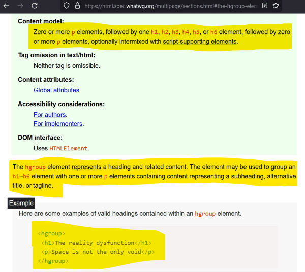
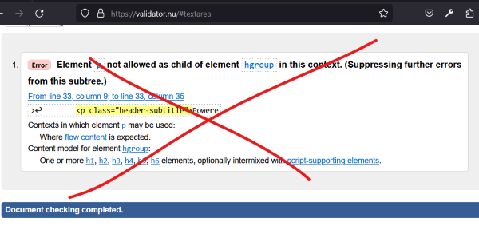
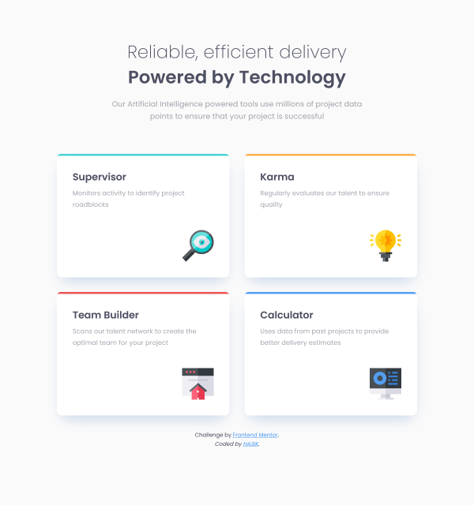

# Frontend Mentor - Four card feature section solution

This is a solution to the [Four card feature section challenge on Frontend Mentor](https://www.frontendmentor.io/challenges/four-card-feature-section-weK1eFYK).  
Frontend Mentor challenges help you improve your coding skills by building realistic projects.  
The solution *live URL*: [Four card feature section by HA3IK](https://ha3ik.github.io/fep/four-card-feature-section)

## Table of contents

- [Overview](#overview)
- [About](#about)
  - [Built with](#built-with)
  - [Author](#author)

## Overview

### NO Flex/Grid

✅ Used the `columns`:  
`columns: 3` >  
`display: inline-block`

### Semantics of the complex header

The usage of `hgroup` has changed (years ago), and according to the official WHATWG Living Standard <time datetime="2023-06-12">12 June 2023</time>:



But, unfortunately, the official W3C validator, which is also referred to by WHATWG, does not know about this and issues an error 😥



⚠️ Don't blindly trust "The Nu Html Checker" - its database is out of date.

✅ Used the `hgroup`:  
`<hgroup>` >  
`<p>` + `<h1>`

### SVG all-in-one

✅ Added all the icons in one file and change them via URL#fragment:
```css
.icon {
  display:none;
}

#icon-id:target {
  display:inline;
}
```

### \[role=img] to IMG\[href=*.svg] for accessibility purposes

✅ Added extra `[role=img]` attribute for ``, as [recommended by MDN](https://webkit.org/b/216364)

### Tablet version breakpoint

✅ Added a breakpoint for tablets



### Top borders

To match the design, it's not possible to simply set `border-top: 4px solid border`, we end up with ~4px of extra radius:


✅ Added a wrapper element, with a `border-color` background, `border-radius`, and top padding `border-top-width`:


```css
.wrap-tool {
  background: #44d3d2;
  border-radius: 8px;
  padding-top: 4px;
}

.tool {
  background: #fff;
}
```

### Titles 36/54, but not!

By design, subtitle and title:
- font-size: 36px
- line-height: 54px

But the total height of these elements is 102px, which is clearly $` ≠ 54 + 54 `$


✅ Reduced the line heights to 51px.

### Lighthouse

✅ See the [Lighthouse report (for mobile)](https://ha3ik.github.io/fep/four-card-feature-section/_challenge/lighthouse-report-mob.html) here.

## About

### Built with

- NO Flex/Grid, just "columns".
- HTML: Semantic and compliant with the WHATWG "Living Standard", WAI-ARIA…
- CSS: Responsive, rem perfect 😎👍
- Performance: hints, minification, versioned URLs…
- Works fine in IE10+ and relative versions of other browsers (I'm really sorry, the progress 😇!)
  …

### Author

- Frontend Mentor - [@HA3IK](https://www.frontendmentor.io/profile/ha3ik)
- Twitter - [@HA3IK](https://www.twitter.com/ha3ik)
