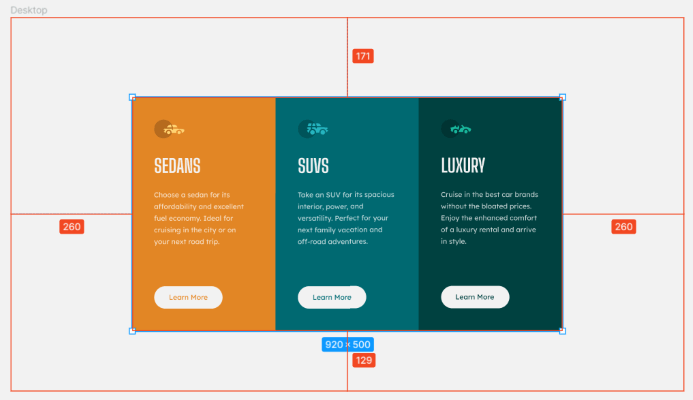
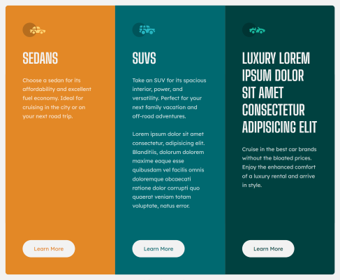

# Frontend Mentor - 3-column preview card component solution

This is a solution to the [3-column preview card component challenge on Frontend Mentor](https://www.frontendmentor.io/challenges/3column-preview-card-component-pH92eAR2-).  
Frontend Mentor challenges help you improve your coding skills by building realistic projects.  
The solution *live URL*: [3-column preview card component by HA3IK](https://ha3ik.github.io/fep/3column-preview-card-component)

## Table of contents

- [Overview](#overview)
- [About](#about)
  - [Built with](#built-with)
  - [Author](#author)

## Overview

### Multiple H1

Since structurally all elements are at the same top level, without an obvious parent element outline in the hierarchy.  
✅ So, three equal sectioning elements with H1 were implemented: `ARTICLE > H1`

### Button or link?

The design doesn't give a hint of further actions after clicking on "Learn more".  
If a pop-up window opens with a more detailed description, then this is a button.  
✅ I decided it is a link that leads to a page with detailed information: `A[rel=help][href=./learn-more]`

### The hidden text of the link

In terms of SEO, it is not recommended to link to different URLs with the same name, such as "Learn more".  
It will also help users of accessibility technologies to better navigate.  
✅ Added hidden text to link names: `{Learn more} > em.screen-hide{ about luxury cars}`

### SVG re-optimization

✅ Done list:

0. Made it all-in-one and change the cars via #fragments (`#luxury:target.car`)
1. Removed extra (it's default): `[fill-rule=nonzero]`
2. Re-`<use/>` the circle part:
```svg
<circle id="c" fill="#000" fill-rule="evenodd" opacity=".201" cx="20" cy="20" r="20" />
...
<use href="#c" />
```

### Beware of hsl!

…Actually, with hex to hsl conversion.  
In the Figma design, the background color of the Luxury column: `#004140` which is inversely = `hsl(179.1,100%,12.7%)`, BUT!
Both VS Code and the "style-guide.md" file specify the color as `hsl(179, 100%, 13%)`, which is inversely = `#004241`.  
The same situation with other colors:  
- `#e28625` = `hsl(31, 77%, 52%)` = `#e38826`;  
- `#006971` = `hsl(184, 100%, 22%)` = `#006970`;

✅ I followed the Figma design and used the exact hex colors.

### Extra top margin on desktop

In the Figma design, the main element is vertically not in the middle. The top margin is 42px larger.



Variables list:
- Figma canvas width: 1440px
- Figma margin top: 171px
- Figma margin bottom: 129px
- My margin bottom: 1%

✅ Calculated the top margin difference for computers:
$$ ((171-129)/1440*100)+1≈3.9167\% $$
```css
/* 1280+ px (PCs) */
@media (min-width: 80rem) {
  .row {
    margin-top: 3.9167%;
  }
}
```

### `outline-offset` support for `:hover`

✅ By default, `:hover` works with the `outline`. If a user agent doesn't support `outline-offset`, then the `border` alternative is used.
- `height` = $ height - border–width * 2 $
- `width` = $ width - border–width * 2 $

```css
@supports not (outline-offset: -0.125rem) {
  .btn {
    border: 0.125rem solid #f2f2f2;
    padding: 0.61875rem; /* as hight and min-width */
  }

  .btn:hover {
    border-color: #fff;
    outline: 0;
  }
}
```

### Overflow-resistant content structure

✅ No matter how much text there is, the structure will always be in shape.



### Attribution _(Out of the challenge)_

✅ Made "absolute", so that it doesn't take up space in the "normal document flow" when centralizing the main content.

### Lighthouse

✅ See the [Lighthouse report (for mobile)](https://ha3ik.github.io/fep/3column-preview-card-component/_challenge/lighthouse-report-mob.html) here.

## About

### Built with

- HTML: Semantic and Valid HTML5, WAI-ARIA…
- CSS: Flexbox, rem perfect 😎👍
- Responsive, Graceful degradation
- Performance: hints, minification, versioned URLs…
- Works fine in IE10+ and relative versions of other browsers (I'm really sorry, the progress 😇!)
- [Sass](https://sass-lang.com/) - CSS preprocessor
- [Gulp.js](https://gulpjs.com/) - toolkit to automate your workflow
- [EditorConfig](https://editorconfig.org/) - file format plugin  
  …

### Author

- Frontend Mentor - [@HA3IK](https://www.frontendmentor.io/profile/ha3ik)
- Twitter - [@HA3IK](https://www.twitter.com/ha3ik)
